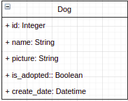

# Como construir

1. Cree un archivo `.compose.env` a partir del archivo de ejemplo `.compose.env-example` y reemplace las variables
2. Cree un docker stack usando el script auxiliar `compose_build.sh`
3. La API por defecto escucha en el puerto 9050

# Prueba técnica para desarrolladores Python Backend.

## Motivación

Una de las principales actividades del área de Backend dentro de Hubtek es la construcción y consumo de API Rest para coordinar el funcionamiento de nuestras plataformas. De esta manera, los
desarrolladores tienen una base sólida en HTTP, construcción de APIs siguiendo [REST](https://restfulapi.net/), uso de [Docker](https://www.docker.com/) y [Celery](https://docs.celeryproject.org/en/stable/).

## Prueba técnica Backend

### Diseño de una API REST

Para esta prueba se requieren conocimientos en Python, protocolo HTTP, verbos HTTP (GET, POST, PUT (PATCH), DELETE). Haciendo uso del marco de desarrollo para Python, se desea que el participante
desarrolle las siguientes funcionalidades:

    1. Obtener un listado de <entidad>
    2. Obtener la información de <entidad> por su identificador único id
    3. Actualizar la información de una <entidad>
    4. Eliminar la <entidad>

La <entidad> con la que vamos a trabajar tiene el siguiente modelo de datos:



La entidad que vamos a manejar en esta ocasión es Dog. Para cumplir con las necesidades enumeradas en las funcionalidades se requiere tener los siguientes Endpoints:

GET -> /api/dogs : Obtener un listado. GET -> /api/dogs/{name} : Obtener una entrada a partir del nombre. GET -> /api/dogs/is_adopted : Obtener todas las entradas donde la bandera is_adopted sea True.
POST -> /api/dogs/{name}: Guardar un registro según el esquema de arriba. El campo picture se debe rellenar con una consulta al API externo https://dog.ceo/api/breeds/image/random.  
PUT ->  /api/dogs/{name}: Actualizar un registro según el nombre. DELETE -> /api/dogs/{name}: Borrar un registro según el nombre.

Un ejemplo de registro:

```
{
    “id”: 1,
    "name": "Lazy",
    "picture": "https:\/\/images.dog.ceo\/breeds\/papillon\/n02086910_6483.jpg",
     "create_date": 2020-02-20 20:58:55.164954
     "is_adopted": True
}
```

Los datos pueden ser guardados utilizando una base de datos (la que el participante desee). Además se deben realizar los siguientes puntos.

1) Las rutas para ingresar un nuevo canino (el POST) debería estar protegida con alguna política de seguridad (recomendamos usar [JWT](https://fastapi.tiangolo.com/tutorial/security/oauth2-jwt/)).

2) Realizar Dockerfile y Docker-compose de la aplicación.

3) Desarrollar una tarea asíncrona con [Celery](https://grega.xyz/2019/07/fastapi-and-celery/) cuando se llame la función POST. Las tareas en segundo plano tienen sentido para actividades que se pueden realizar de forma asíncrona como el envío de
   correos, procesamiento de archivos e inclusive la creación de un registro que no requiere de un retorno. Puedes simular una latencia en el registro de los perros de unos segundos para verificar que
   el "Worker" o “tarea” que implementes está funcionando correctamente, o hacer uso del endpoint /api/workers disponible en [link](https://gttb.guane.dev/docs).

4) Añadir una nueva entidad llamada User con sus respectivos endpoints de CRUD básico. Esta entidad tendrá una relación de uno a muchos con la entidad Dog, es decir, un User puede tener uno o muchos
   Dogs (para esto solo se requiere que la entidad Dog se agregue un nuevo campo llamado id_user y guarde el id de un usuario). Los campos para la entidad User pueden ser: id, name, last_name, email.

5) Enviar un archivo con cualquier extensión al endpoint /api/files disponible en este [link](https://gttb.guane.dev/docs).

### Consideraciones

Finalmente, el código debe estar en un repositorio remoto (GitHub, GitLab, BitBucket) llamado "hubtek-intern-api". También debe seguir el estándar PEP8 en la codificación con directrices de buenas
prácticas. Aunque la construcción de una API es una tarea bastante común hoy en día, el objetivo de esta práctica es verificar tus conocimientos tanto de la calidad del código como de la arquitectura
del software. Es esencial el uso de un Python moderno, como el uso de operaciones asíncronas. Vemos la utilidad de la asignación de tipos utilizando marcos como Pydantic y Typing. En la misma línea,
hemos trabajado en frameworks como Starlette o FastAPI que se basan en estas mejores prácticas.